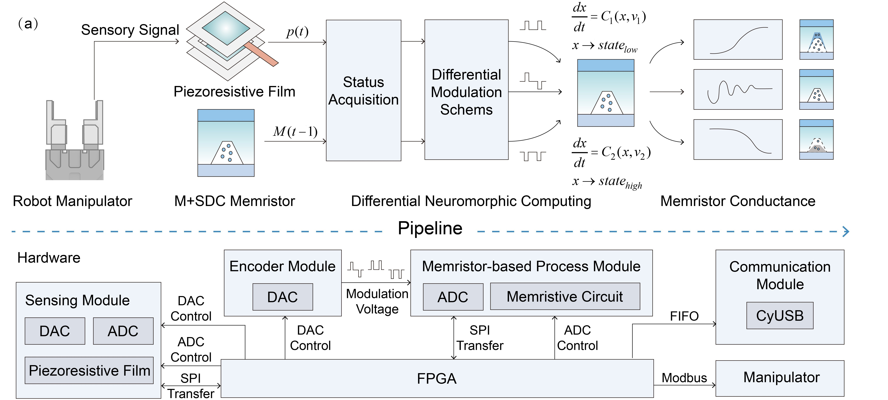
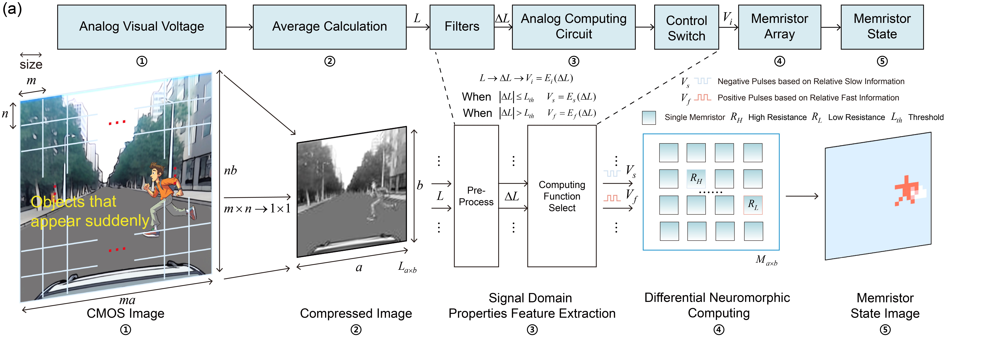

# Differential Neuromorphic Computing
Differential Neuromorphic Computing is a perceptual signal processing method employing multi-branch functions to equip intelligent machines with neuromorphic style sensory adaptation to environmental stimuli. In the memristive implementation,this method focuses on extracting features from unstructured sensory data. It then employs a unique adaptive modulation scheme, known as differential encoding, to significantly enhance the adaptability of intelligent machines operating within unstructured environments. Detailed insights and methodologies are discussed in our manuscript available at https://arxiv.org/abs/2309.08835. This repository provides the codes necessary for implementing Differential Neuromorphic Computing for processing tactile and visual information.

## Tactile processing system
Within the 'Tactile' folder, Verilog codes and configuration files for the tactile processing system described in our manuscript are provided (Figure 1), which is based on FPGA systems. The FPGA Verilog code encompasses several critical functions: acquisition of external pressure information, reading of the memristor state, selection of the adaptive modulation, and external communication protocols. Moreover, the folder contains configuration files and a digital simulation designed to replicate the equivalent function of the tactile processing demonstration.

## Visual processing system
For visual processing, we apply our differential neuromorphic computing approach to capture and process frequency-based visual attributes. The entire process is illustrated in Figure 2. We utilize a memristor array of 25×40 to process CMOS images with a resolution of 1920×900. These images are sourced from a driving recorder and processed through SPICE simulations. During the simulations, the video footage from the recorder is segmented into individual frames. These frames are then converted into a continuous voltage profile, i.e., Piece-Wise Linear (PWL) waveform description, which serves as input for the subsequent SPICE simulations. The necessary codes and datasets for implementing differential neuromorphic computing for processing visual information are provided within the 'Visual' folder.

## Capabilities
 For tactile processing, this repository enables the use of memristors with diverse switching mechanisms to perform a variety of processing functions, utilizing our Verilog codes and configuration files. For visual processing, the entire workflow described in our manuscript can be replicated through simulations.

Version 1.1
Please feel free to contact me if there are any questions. Email: shengb.wang@gmail.com
